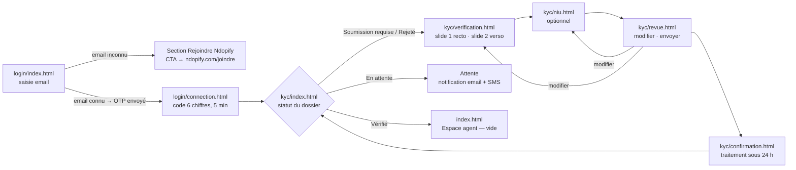

# Ndopify Partner Central — Journey Maps (Stage 1)

Sources: *Ndopify Partner Central* (structure du site), *Ndopify — Pitch*, *Ndopify Vision + Mission*.
Supersedes `agent-onboarding.md` and the previous revision of this file wherever they differ.

**Revision 2026-10-10 (b) — source doc restructured.** Changes from the previous revision:

- File layout is now prescribed: `login/index.html`, `login/connection.html`, `kyc/index.html`,
  `kyc/verification.html`, `kyc/niu.html`, `kyc/revue.html`, `kyc/confirmation.html`, `index.html` (Espace agent).
  The old `connexion.html` / `tableau-de-bord.html` / `espace-agent.html` / `profil.html` names are gone.
- The KYC wizard is now **one page per step**: `verification.html` (itself a 2-slide slideshow: recto, verso) →
  `niu.html` (optionnel) → `revue.html` (modifiable, submit lives here) → `confirmation.html`.
- *Rejoindre Ndopify* is now **1 paragraph of 1–2 sentences** + a centered CTA.
- **No `profil.html`**: the header menu lists *Profil* but the doc defines no Profil page, and forbids undefined
  sections. *Profil* is rendered as a visibly unavailable item (« Bientôt disponible ») rather than a dead link.

Rules carried over unchanged: no remuneration/commission amounts or percentages anywhere; OTP resend has no timer;
hints in an info panel (info icon, slightly smaller text) that never hides once the form is valid; submit buttons
disabled until every field is valid; multi-step forms as slideshows with Précédent / Suivant; centered CTAs;
header = logo image only + user menu (initials icon → Profil, Déconnexion).

## Audiences and flows

Partner Central is used by **agents / démarcheurs** only. The three audiences are the three states an agent arrives
in:

| # | Audience / flow                                 | Entry state                            | Pages                                                              | Exit state                                              |
|---|-------------------------------------------------|----------------------------------------|--------------------------------------------------------------------|---------------------------------------------------------|
| A | Démarcheur prospect — **Rejoindre**             | Email inconnu                          | `login/index.html` (section *Rejoindre Ndopify*)                   | Redirigé vers `https://www.ndopify.com/joindre`         |
| B | Agent inscrit — **Connexion par code**          | Email connu                            | `login/index.html` → `login/connection.html`                       | Connecté → `kyc/index.html` (ou `index.html` si vérifié) |
| C | Agent non vérifié — **Vérification d'identité** | *Soumission requise* / *Rejeté*        | `kyc/index.html` → `verification.html` → `niu.html` → `revue.html` → `confirmation.html` | *En attente* (24 h) → *Vérifié* → `index.html`          |

**"The three wizard pages" (Stage 3)** = the three KYC data-entry pages `kyc/verification.html`, `kyc/niu.html`,
`kyc/revue.html`. They are the only multi-step form in the doc (confirmation is the terminal state, not a step).
The two login pages are single-field forms; they still get the persona walkthrough below, but are not "wizard"
pages.

Wizard progress is counted across pages: **Étape 1 sur 4** recto, **2 sur 4** verso, **3 sur 4** NIU, **4 sur 4**
revue. Confirmation carries no step number.

---

## Context that shapes every screen

- **Who they are:** démarcheurs de terrain à Yaoundé (phase 1), Android, données mobiles, à l'aise avec WhatsApp et
  Mobile Money, beaucoup moins avec les formulaires web. Revenus irréguliers, souvent « sautés ».
- **Core fear:** se faire contourner — faire des visites gratuitement puis perdre la commission. Second fear: confier
  sa CNI à une plateforme inconnue.
- **Core motivation (pitch):** indemnité garantie pour chaque visite, part de la commission versée sur Mobile Money,
  co-courtage avec répartition verrouillée, adresse et contacts du bailleur masqués (anti-sautage), statut d'Agent
  Vérifié. *Amounts and percentages exist in the pitch but must never be displayed.*
- **Trust lever:** la vérification est le produit — le statut « Agent vérifié » est ce qui rassure locataires et
  bailleurs. Copy frames KYC as a status gained, not suspicion.
- **Voice:** vouvoiement, phrases courtes, concret, pas de jargon (« pièce d'identité », pas « KYC »).

---

## Flow A — Démarcheur prospect: découvrir et rejoindre

**Persona:** Serge, 31 ans, démarcheur à Biyem-Assi depuis 4 ans, Android, MTN MoMo. Lien reçu dans un groupe
WhatsApp. Sceptique : « encore une appli qui va prendre notre part ».

| Stage | Touchpoint | Action | Thinking | Emotion | Pain point / risk | Design response |
|---|---|---|---|---|---|---|
| Arrivée | Lien WhatsApp → `login/index.html` | Ouvre sur mobile | « C'est pour qui ? » | 0 | Page de login brute = rebond pour un non-inscrit | H1 « Espace partenaires » + sous-titre qui dit que le même champ sert aux nouveaux |
| Essai | Champ email | Saisit son email | « Je n'ai pas de compte… » | −1 | Email inconnu vécu comme une erreur | Réponse en bleu info, pas en rouge : « Pas encore de compte avec cet email » + défilement et focus vers *Rejoindre Ndopify* |
| Considération | Section *Rejoindre Ndopify* | Lit 1–2 phrases | « Qui paie, et est-ce qu'on me saute ? » | −1 → +1 | Résumé abstrait ; 2 phrases max | Phrase 1 : indemnité à chaque visite + part de commission sur Mobile Money. Phrase 2 : contacts du bailleur masqués, répartition fixée d'avance. Aucun montant |
| Décision | CTA centré | Touche le CTA | « Ça vaut le coup d'essayer » | +1 | CTA vague | « Rejoindre Ndopify » → `https://www.ndopify.com/joindre` |

## Flow B — Agent inscrit: connexion par code

**Persona:** Aïcha, 27 ans, agente à Bastos, inscrite la semaine dernière, change souvent d'app sur son téléphone.

| Stage | Touchpoint | Action | Thinking | Emotion | Pain point / risk | Design response |
|---|---|---|---|---|---|---|
| Email | `login/index.html` | Saisit l'email | « Pas de mot de passe ? » | 0 | Attend un mot de passe | Hint : « Nous vous envoyons un code à usage unique par email. Aucun mot de passe. » |
| Validation | Bouton « Recevoir mon code » | Désactivé tant que l'email est invalide | « Pourquoi je ne peux pas cliquer ? » | −1 | Bouton désactivé muet | Hint toujours visible + message de champ qui dit ce qui manque |
| Changement d'app | App mail | Copie le code | « Je reviens où ? » | −1 | Page rechargée et vide | Email masqué + échéance conservés en `sessionStorage` |
| Code | `login/connection.html` | Colle le code | « Ça marche ? » | 0 | 6 cases séparées qui refusent le collage | Un seul champ `autocomplete="one-time-code"`, `inputmode="numeric"` |
| Erreur | Code incorrect | Réessaie | « Combien d'essais ? » | −2 | Blocage silencieux | « Code incorrect. Il vous reste N essais. » ; au blocage : demander un nouveau code |
| Expiration | Après 5 min | — | « Il a expiré ? » | −1 | Expiration non annoncée | Échéance affichée (« valable jusqu'à 14 h 32 »), annonce live à expiration |
| Renvoi | Lien « Renvoyer le code » | Touche | « Je l'ai pas reçu » | 0 | Minuterie frustrante | **Toujours disponible, sans minuterie** (source doc) ; confirmation « Nouveau code envoyé » |
| Succès | Redirection | — | « C'est bon » | +1 | — | `kyc/index.html` si non vérifié, `index.html` si vérifié |

## Flow C — Agent non vérifié: vérification d'identité

**Persona:** Serge (Flow A), revenu après inscription. Peur de confier sa CNI ; photos prises dehors au téléphone.

| Stage | Touchpoint | Action | Thinking | Emotion | Pain point / risk | Design response |
|---|---|---|---|---|---|---|
| Statut | `kyc/index.html` — *Soumission requise* | Lit | « Pourquoi ? » | −1 | Ressenti comme de la méfiance | Bénéfice d'abord : la vérification débloque l'accès et le statut d'agent vérifié ; avertissement « un agent non vérifié ne peut pas exercer » ; CTA centré « Commencer la vérification » |
| Recto | `verification.html` slide 1 | Photographie le recto | « C'est quelle face ? » | 0 | Mauvaise face, reflets, flou | « Recto — face avant, avec votre photo » ; règles (formats, 5 Mo, lisibilité, sans reflet, pièce en cours de validité) dans le panneau d'information ; aperçu immédiat |
| Fichier refusé | Contrôle client | — | « Ça ne passe pas » | −2 | Erreur vague | Erreur précise : format ou taille avec la limite exacte (5 Mo) ; on ne passe pas à la suite |
| Verso | `verification.html` slide 2 | Photographie le verso | « Encore une ? » | 0 | Fatigue | Même guide ; Précédent pour revenir au recto sans perte |
| NIU | `niu.html` | Saisit ou passe | « C'est obligatoire ? » | 0 | Jargon, peur d'être bloqué | « Numéro d'identifiant unique (NIU) — optionnel » ; où le trouver ; Suivant actif sans NIU, format vérifié s'il est saisi |
| Revue | `revue.html` | Relit, modifie, envoie | « Et s'ils refusent ? » | −1 | Incertitude, peur d'envoyer une erreur | Chaque élément avec « Modifier » ; ce qui suit (24 h, email + SMS, rapprochement nom CNI ↔ titulaire Mobile Money) ; seul bouton de soumission du parcours |
| Confirmation | `confirmation.html` | Lit | « 24 h, d'accord » | +2 | — | « Documents reçus », délai, canaux de notification, retour au statut |
| Attente | `kyc/index.html` — *En attente* | Revient | « Toujours rien ? » | −1 | Attente opaque | Suivi : Envoyé → En cours d'analyse → Vérifié |
| Rejet | `kyc/index.html` — *Rejeté* | Lit | « Pourquoi ? » | −2 | Rejet générique | Motif explicite + CTA « Soumettre de nouveaux documents » |
| Succès | `kyc/index.html` — *Vérifié* → `index.html` | Ouvre | « Enfin » | +3 | Espace agent vide (source doc) | Page vide assumée : seulement le titre, aucun module ni promesse inventés |

---

## Synthetic persona results — baseline for Stage 3

Predictive walkthrough with impeccable's Form-heavy/wizard trio. Stage 3 compares its findings against these
tables and surfaces any disagreement.

### Jordan — confused first-timer

| Page | Prediction | Severity | Requirement for Stage 2 |
|---|---|---|---|
| login/index | Ne sait pas s'il doit s'inscrire ou se connecter | High | Un seul champ ; sous-titre qui couvre les deux cas |
| login/index | Email inconnu perçu comme une erreur | Medium | Message en ton info, focus déplacé vers *Rejoindre Ndopify* |
| login/connection | Attend le code par SMS | Medium | « par email » + adresse masquée visible |
| verification | Ne sait pas quelle face est le recto | Medium | « face avant, avec votre photo » + pictogramme de carte |
| verification | Ne comprend pas pourquoi « Suivant » est grisé | Medium | Hint toujours visible : « ajoutez une photo pour continuer » |
| niu | Ne sait pas ce qu'est le NIU, ni s'il est obligatoire | Medium | Nom complet + « (optionnel) » + où le trouver |
| revue | Craint de ne pas pouvoir corriger | Medium | « Modifier » par élément, retour à la revue après correction |
| revue | Craint les conséquences de l'envoi | Medium | « Ce qui se passe ensuite » avant le bouton |

### Sam — keyboard / screen reader

| Page | Prediction | Severity | Requirement |
|---|---|---|---|
| verification | Changement de slide non annoncé | High | `role="progressbar"` avec `aria-valuetext`, focus sur le titre de la slide |
| verification | Zone de dépôt en `div` non utilisable au clavier | High | `<input type="file">` natif avec libellé visible |
| all forms | Erreurs signalées par la couleur seule | High | Texte d'erreur lié par `aria-describedby`, `aria-invalid`, focus sur le premier champ invalide |
| all forms | Bouton désactivé sans explication | Medium | Bouton désactivé (source doc) + hint lié par `aria-describedby` qui dit pourquoi |
| revue | « Modifier » ambigu répété | Medium | Nom accessible complet : « Modifier le recto », etc. |
| login/connection | Expiration non annoncée | Medium | Région live polie à l'expiration ; « Renvoyer » toujours au clavier |
| all | Menu utilisateur inaccessible | Medium | `<button aria-expanded>` + Échap pour fermer |

### Casey — distracted mobile user

| Page | Prediction | Severity | Requirement |
|---|---|---|---|
| login/connection | Revient de l'app mail sur une page vide | High | Email masqué + échéance en `sessionStorage` |
| login/connection | Ne peut pas coller le code | High | Champ unique `one-time-code` |
| verification | Envoie une photo de 8 Mo | High | Contrôle 5 Mo + format avant d'avancer, limite exacte dans l'erreur |
| verification → revue | Interrompu entre deux pages | Medium | Aperçus réduits + NIU conservés en `sessionStorage` ; la revue les relit |
| revue | Arrive sur la revue sans photos (session perdue) | Medium | État explicite « photo manquante » + lien pour la reprendre ; envoi désactivé |
| all | Bouton principal hors de portée du pouce | Medium | Boutons pleine largeur sur mobile, empilés en bas de l'étape |

---

## Source-doc ambiguities surfaced during mapping

- **`connection.html`**: the doc uses the English-ish spelling; the file name is kept exactly as written.
- **Step numbering:** the doc jumps from "Étape 4 : Revue" to "Étape 6 : Confirmation" — treated as a typo.
- **NIU:** the pitch says NIU is mandatory; the Partner Central doc says optional. Following Partner Central;
  flagged for product.
- **Document types:** "pièces d'identité officielles (ex: CNI)" vs. the pitch's "CNI valide". Copy speaks of
  "carte nationale d'identité" as the expected document.
- **Profil:** listed in the header menu, no page defined. Rendered as unavailable, not as a link.
- **Rate limiting values** unspecified. Prototype: 5 essais par code.
- **Automated quality checks** (lisibilité, reflets, validité) are server-side; the prototype states them as rules
  and checks format/size client-side only.
- **Status demo:** `kyc/index.html` renders all four statuses; the prototype selects one via `?statut=` so each
  can be reviewed. The real page gets it from the API.
- **Data handling for the CNI** (who sees it, retention) and a **support channel** are in no source doc — not shown;
  need product copy.
